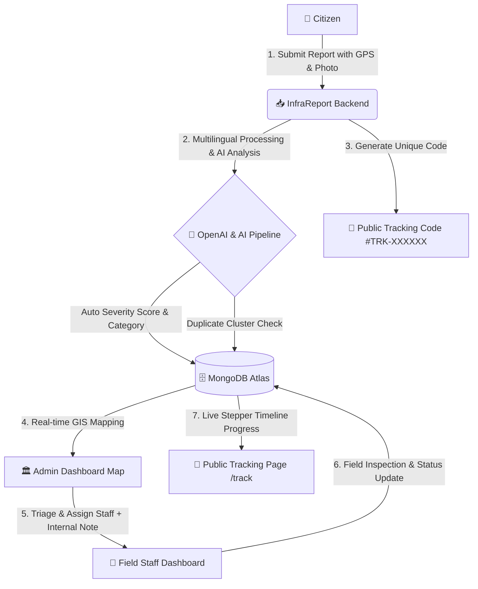

# 🏗️ InfraReport — Public Infrastructure Issue Reporting System


**InfraReport** is an AI-powered, intelligent Public Infrastructure Issue Reporting & National Management System designed for Bangladesh. It seamlessly bridges the gap between **Citizens**, **Field Staff**, and **Government Administrators** to report, triage, assign, track, and resolve public infrastructure issues (roads, water supply, electricity, waste, drainage, streetlights, bridges, etc.) with real-time GIS mapping and AI automation.

---

## 🌟 Key Highlights & Core Features

### 👤 Citizen Portal
- 📝 **Multilingual Issue Reporting:** Submit issues with title, category, description (Bangla, English, or Banglish), photos, and precise GPS location.
- 🎯 **GPS Auto-Detection:** One-click automatic location detection via browser geolocation.
- 🔎 **Public Issue Tracker (`/track`):** Track any report's live status using a unique 6-digit tracking code (`#TRK-XXXXXX`) without logging in.
- 🗺️ **Interactive Citizen Map ("My Area"):** View public pins with personalized highlighted markers for own submitted reports.
- 📄 **PDF Export & Upvoting:** Download official PDF copies of submitted reports and upvote community infrastructure issues.

### 👷 Field Staff Portal
- 📋 **Assigned Task Dashboard:** Filter and manage tasks assigned directly to the logged-in staff member.
- 📝 **Internal Admin Work Instructions:** View confidential internal notes and field instructions provided by government administrators.
- ⚡ **Workflow Status Updates:** Transition issue statuses sequentially (`Assigned` ➔ `In Progress` ➔ `Working` ➔ `Resolved`).

### 🏛️ Government Admin Portal
- 🗺️ **National Overview GIS Map:** Interactive Bangladesh map covering all **64 Districts** with live GIS pin clustering.
- 🚨 **Critical & High Triage Toggle:** One-click filtering to isolate high-priority critical infrastructure failures instantly.
- 🤖 **AI-Automated Analysis & Duplicate Detection:**
  - Automated severity scoring (1–10 scale) and priority classification.
  - Geographical & textual duplicate cluster detection to spot pattern reports.
  - Multi-language translation & executive summary generation via OpenAI.
- 👥 **Staff Assignment with Internal Notes:** Assign department staff members to specific issues with customized work instructions.
- 📊 **Analytics & Reporting:** Visual breakdown charts (status distribution, category metrics, severity analytics) and user role management.

---

## 🗺️ System Workflow Architecture



---

## 🛠️ Technology Stack

### Frontend (`/Client Side`)
- **Core Framework:** React 19, Vite 7
- **Styling:** Vanilla CSS, TailwindCSS v4, Framer Motion
- **State Management & Data Fetching:** TanStack React Query v5, Axios
- **GIS Mapping:** Leaflet, React-Leaflet
- **Data Visualization & Export:** Recharts, React PDF Renderer (`@react-pdf/renderer`)
- **Icons & Notifications:** React Icons, Lucide React, React Hot Toast

### Backend (`/Server Side`)
- **Runtime & Server:** Node.js v22, Express v5
- **Database:** MongoDB Atlas (Native MongoDB Driver & Mongoose)
- **Authentication & Security:** JWT (JSON Web Tokens), Bcrypt.js, Firebase Admin SDK
- **Artificial Intelligence:** OpenAI GPT-4o API, `string-similarity` algorithm
- **Environment & Utilities:** Dotenv, CORS, Nodemon

---

## 📁 Project Directory Structure

```
Public Infrastructure/
├── 📁 Client Side/                  # Frontend React + Vite Application
│   ├── 📁 src/
│   │   ├── 📁 components/           # Reusable UI components (Navbar, BangladeshIssueMap, Footer)
│   │   ├── 📁 context/              # Authentication Context (AuthContext.jsx)
│   │   ├── 📁 pages/                # Page Views (Home, Dashboard, TrackIssue, ReportIssue, etc.)
│   │   ├── 📁 utils/                # API helpers (axios configuration, endpoints)
│   │   ├── App.jsx                  # Main Routing & Layout Setup
│   │   └── main.jsx                 # Application Entry Point
│   ├── package.json                 # Frontend dependencies & scripts
│   └── vite.config.js               # Vite Configuration
│
└── 📁 Server Side/                  # Backend Node.js + Express API
    ├── 📁 models/                   # Mongoose Schemas (User.js, Report.js)
    ├── 📁 scripts/                  # Utility scripts (fixStaffPasswords.js, backfillGeocoding.js)
    ├── index.js                     # Main Express API Server & Endpoints
    ├── seed.js                      # Database Seeder script
    ├── package.json                 # Backend dependencies & scripts
    └── .env                         # Server Environment Variables
```

---

## 🚀 Getting Started & Local Setup

### Prerequisites
- **Node.js** (v18 or higher recommended)
- **npm** or **yarn**
- **MongoDB Atlas** cluster or local MongoDB instance

---

### 1️⃣ Installation

Clone the repository and install dependencies for both Client and Server:

```bash
# Clone the repository
git clone https://github.com/sonatonroyofficial/Public-Infrastructure.git
cd "Public Infrastructure"

# Install Backend Dependencies
cd "Server Side"
npm install

# Install Frontend Dependencies
cd "../Client Side"
npm install
```

---

### 2️⃣ Environment Configuration

Create a `.env` file in the `Server Side` directory:

```env
PORT=5000
MONGODB_URI=mongodb+srv://<username>:<password>@<cluster>.mongodb.net/infrastructure_reporting?retryWrites=true&w=majority
JWT_SECRET=your-super-secret-jwt-key
OPENAI_API_KEY=your-openai-api-key
```

---

### 3️⃣ Running the Application

Start both the backend server and frontend development server:

#### Terminal 1 — Backend Server:
```bash
cd "Server Side"
npm run dev
```
> Server runs on `http://localhost:5000`

#### Terminal 2 — Frontend App:
```bash
cd "Client Side"
npm run dev
```
> Client runs on `http://localhost:5173` (or as displayed in Vite terminal)

---

## 🔑 Demo Access Credentials

For testing and demonstration, use the following pre-configured user accounts:

| User Role | Email | Password | Access Rights |
| :--- | :--- | :--- | :--- |
| 👑 **Admin** | `sonaton.fl@gmail.com` | `sonaton123` | Full National GIS Overview Map, Triage, Staff Assignment, Analytics |
| 👷 **Staff (City)** | `city@gmail.com` | `city123` | Assigned Tasks, Internal Notes View, Status Update Workflow |
| 👷 **Staff (Water)** | `water@gmail.com` | `staff123` | Assigned Tasks, Internal Notes View, Status Update Workflow |
| 👷 **Staff (Fire)** | `fire@gmail.com` | `fire123` | Assigned Tasks, Internal Notes View, Status Update Workflow |
| 👤 **Citizen** | `citizen@gmail.com` | `citizen123` | Report Submission, My Area Map, Public Issue Tracking |

---

## 📡 API Endpoints Overview

| Method | Endpoint | Access | Description |
| :--- | :--- | :--- | :--- |
| `POST` | `/api/auth/login` | Public | Authenticate user & issue JWT token |
| `POST` | `/api/auth/register` | Public | Register new Citizen account |
| `GET` | `/api/reports/track/:trackingCode` | Public | Public issue tracking by 6-digit code |
| `GET` | `/api/map/pins` | Public/Auth | Fetch GIS pins for interactive Bangladesh map |
| `POST` | `/api/issues` | Citizen | Submit a new infrastructure report |
| `PUT` | `/api/issues/:id/assign` | Admin | Assign staff to issue with internal instructions |
| `PATCH` | `/api/issues/:id/status` | Staff/Admin | Update issue resolution status |
| `POST` | `/api/staff` | Admin | Create a new Field Staff account |

---

## 📝 License

This project is open-source and available under the [MIT License](LICENSE).

---

<p center align="center">
  Crafted with ❤️ for <b>Smart Bangladesh</b> Infrastructure Modernization.
</p>
